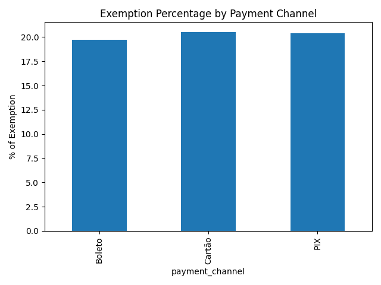

# 🔎 Transaction Fee Exemptions — Detection & Monitoring

End-to-end project to ensure **transaction fees are applied correctly**, respecting exemption rules that are not always explicitly documented.  
It combines **synthetic data generation, rule discovery with a Decision Tree, validation, and daily automated monitoring**.

---

## 📖 Overview
- Generate **10,000 synthetic transactions** with ~20% exemptions.
- Learn interpretable patterns with a **Decision Tree Classifier**.
- Validate the rule with accuracy and confusion matrix (**~99.8%** on the synthetic setup).
- Schedule a **daily monitoring** job at 08:00 to keep the logic under control.
- Produce **visual analytics** for clear interpretation.

---

## 🛠 Tech Stack
- **Python**: pandas, NumPy, scikit-learn, schedule  
- **Visualization**: matplotlib  
- **Automation**: daily scheduler

---

## 🚀 How to Run
```bash
# 1) create & activate venv (optional)
python3 -m venv .venv && source .venv/bin/activate

# 2) install deps
pip install -r requirements.txt

# 3) generate synthetic data
python generate_synthetic_data.py        # saves data/synthetic_transactions.csv

# 4) extract rules (optional)
python decision_tree_rules.py

# 5) validate rule (optional)
python validate_exemption_rule.py

# 6) create figures for the README
python scripts/make_plots.py
```

📊 Results
<p align="center">   </p> <p align="center">   </p>

📂 Repository Structure
├── data/
│   └── synthetic_transactions.csv
├── figures/
├── scripts/
│   └── make_plots.py
├── generate_synthetic_data.py
├── decision_tree_rules.py
├── validate_exemption_rule.py
├── scheduling_monitor.py
├── requirements.txt
├── .gitignore
└── README.md

📮 Next Steps

Add secondary rules for edge cases

Email/Slack alerts for anomalies

Interactive dashboard (e.g., Power BI)

Quarterly audits of exemption logic
